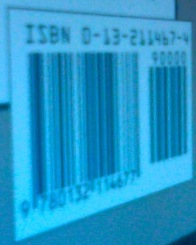
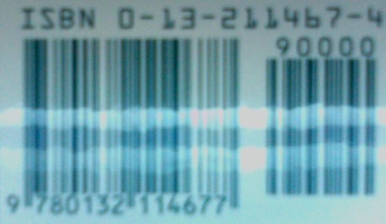
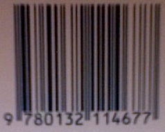
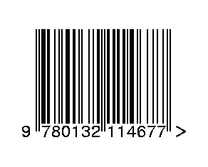
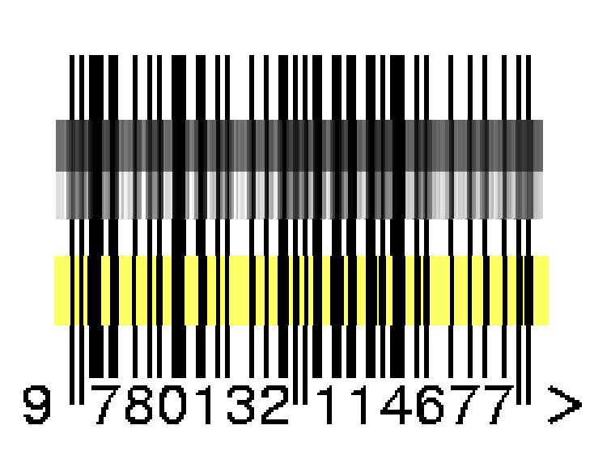

# 第 12 章：条形码识别 {#barcode-recongnition}

本章我们将用第十章开发的图像分析库来制作一个条形码识别应用。只要用手机的摄像头拍下书的封底，我们就能用这个程序来提取这本书的ISBN编号。

## 条形码简介 {#a-little-bit-about-barcodes}

市售绝大多数带有外包装的量产消费品上都有一个条形码。尽管有很多种不同的条形码系统在多个专业领域中被使用，但是在消费品中最典型的条形码系统还是UPC-A和EAN-13两种。UPC-A由美国开发，而EAN-13最初由欧洲开发。

EAN-13发表于UPC-A之后，它是UPC-A的超集。（事实上，尽管UPC-A现在在美国依然被广泛使用，但该标准早在在2005年已经被官方宣布作废了。)任何可以识别EAN-13条形码的硬件都可以兼容UPC-A条形码。这样我们只介绍EAN-13一种标准就可以了。

正如其名字所暗示的，EAN-13描述了一个由13个数字组成的序列，该序列可以分为四组：

-   最前的两个数字描述了条形码采用的 *码制* 。这两位数字可以标识生产商所在国家，或者描述该条码的类别，比方说ISBN(国际标准书号)。

\[译注1：确切的讲，此处的"生产商所在国"实际上是指"为该生产商分配生产商代码的编码管理局所属国家"\]

\[译注2：事实上，码制的长度可能为两位甚至更多位，但目前GS1 General Specifications中给出的最长的码制也只有3位。例如某条形码的类别是ISBN码的话，那么它的码制部分应该为978(后文中给出的实际图中也可以看到)；如果类别是ISSN(International Standard Serial Number，国际标准连续出版物号)，则码制为977。其他部分的长度也比本章介绍的要更有弹性，但这些差异并不会影响对本章内容的理解。事实上，这一部分的内容在本章后面的内容中也完全用不到，因为我们在从条码的图形中提取出数字序列后，并没有进一步分离出各个分组乃至查询每个分组表示的具体信息。\]

-   接下来的五个数字为厂商代码，由各国的编码规范机构分配。
-   再接下来的5个数字是产品代码，由生产厂商决定。(规模较小的生产商可能会使用较长的生产商ID和较短的产品ID，但是两个ID加起总是10个数字。)
-   最后一个数字为 *校验码(check digit)* ，扫描设备可以通过它来校验扫描到的数字串。

EAN-13条形码与UPC-A条形码的唯一不同在于后者只用一位数字表示码制。EAN-13条形码通过将码制的第一位数字置零实现对UPC-A的兼容。

### EAN-13编码 {#ean-13-encoding}

在考虑怎样解码EAN-13条形码之前，我们还是得先了解它是怎样被编码出来的。EAN-13的编码规则有一点复杂。我们先从计算校验码------即数字串的最后一位开始。

```haskell
-- file: ch12/Barcode.hs
checkDigit :: (Integral a) => [a] -> a
checkDigit ds = productSum `mod` 10 `mod` 10
    where productSum = sum products (mapEveryOther (*3) (reverse ds))

mapEveryOther :: (a -> a) -> [a] -> [a]
mapEveryOther f = zipWith ($) (cycle [f,id])
```

\[译注1：原文对checkDigit函数的实现有问题，翻译时用了比较直接的方法修正了代码，并相应的修改了下面一段正文中对代码的描述\]

\[译注2：你可能觉得如果把 `mapEveryOther` 中的 `f` 和 `id` 两个列表元素的位置对调的话，就可以省略掉 `checkDigit` 的where块中的 `reverse` 过程。事实上这个reverse过程是必须的，而且 `f` 和 `id` 也不能对调。因为EAN-13的标准规定，"将序列中的最右侧的数字规定为 `奇数位`，从最右侧开始，其余数字被交替记为 `偶数位` 和 `奇数位`，而只有奇数位的数字会被乘以3。如果采取最开始说的方法，那么假如输入的序列包含偶数个元素的话，那么整个计算过程就是错误的。这一点的重要性在后文会有体现。\]

直接看代码应该比文字描述更有助于理解校验码的计算方法。函数从数字串的最右一位数字开始，每隔一位就将该数字乘以3，其余保持原状。接下来对处理后的列表求和，校验码就是将这个列表的和对10取模两次得到的结果。

条形码是一系列定宽的条纹，其中黑色的条纹表示二进制的"1"，白色的条纹表示二进制的"0"。表示相同二进制的条纹值连续排列看起来就是宽一些的条纹。

条形码中的各个二进制位的顺序如下：

-   头部保护序列，固定编码101。
-   一个由六个数字组成的分组，其中每个数字由7个二进制位表示
-   另一个保护序列，固定编码01010
-   另一个六个数字的组成的分组 (译注：每个数字也由7个二进制位表示)
-   尾部保护序列，固定编码101

左右两个分组中的数字有不同的编码。左侧分组的数字编码包含了校验位(parity bit)，而校验位编码了条形码的第13个数字。

\[译注：请注意区分此处所提到的校验位(parity bit)以及后面会经常提及的校验码(check digit)，在本文中，只需要将这个校验位理解为一种只由二进制编码模式(pattern)来区分(而不是"计算")的信息，并且了解它只包含奇和偶两种取值即可，没必要深究"哪一位是校验位"。\]

## 引入数组 {#introducing-arrays}

在继续前，我们先来看看在本章接下来会用到的所有导入模块。

```haskell
-- file: ch12/Barcode.hs
import Data.Array (Array(..), (!), bounds, elems, indices,
               		ixmap, listArray)

import Control.Applicative ((<$>))
import Control.Monad (forM_)
import Data.Char (digitToInt)
import Data.Ix (Ix(..))
import Data.List (foldl', group, sort, sortBy, tails)
import Data.Maybe (catMaybes, listToMaybe)
import Data.Ratio (Ratio)
import Data.Word (Word8)
import System.Environment (getArgs)
import qualified Data.ByteString.Lazy.Char8 as L
import qualified Data.Map as M

import Parse                    -- from chapter 11
```

条形码的编码过程基本上可以采用表驱动的形式实现，即采用保存了位模式的小规模对照表来决定如何为每个数字进行编码。Haskell中的基本数据类型------列表和元组------都不太适合构造这种可能涉及随机访问的表。列表需要靠线性遍历才能访问到第 *k* 个元素。元组没有这个问题，但是Haskell的类型系统使我们很难编写一个接受元组和偏量，返回该元组内指定偏移元素的函数。(我们会在下面的练习中探究为什么这很难。)

说起常见的支持常数时间随机访问的数据结构，数组(array)自然首当其冲。Haskell提供了多种数组数据类型，我们可以利用它们将编码表表示为字符串构成的数组。

最简单的数组类型位于 `Data.Array` 模块，它正是我们要此处要用到的类型。该类型可以表示由任何Haskell类型的值构成的数组。与普通的Haskell类型一样，该类型的数组都是不可变的。不可变的数组的值只能在它被创建的时候填充一次，之后它的内容就无法被修改了。(标准库也提供了其他的数组类型，其中有一部分是可变的，但我们暂时还不会涉及到它们。)

```haskell
-- file: ch12/Barcode.hs

leftOddList = ["0001101", "0011001", "0010011", "0111101", "0100011",
               "0110001", "0101111", "0111011", "0110111", "0001011"]

rightList = map complement <$> leftOddList
	where complement '0' = '1'
      	complement '1' = '0'

leftEvenList = map reverse rightList

parityList = ["111111", "110100", "110010", "110001", "101100",
          	"100110", "100011", "101010", "101001", "100101"]

listToArray :: [a] -> Array Int a
listToArray xs = listArray (0,l-1) xs
	where l = length xs

leftOddCodes, leftEvenCodes, rightCodes, parityCodes :: Array Int String

leftOddCodes = listToArray leftOddList
leftEvenCodes = listToArray leftEvenList
rightCodes = listToArray rightList
parityCodes = listToArray parityList
```

\[译注：强烈建议读者在继续阅读前参考本地址中关于EAN-13条码二进制编码算法的介绍。如果你已经看过上面的内容，我们也稍微展开说明一下：从代码中给出的rightList和leftEvenList的计算过程可以发现，即使同一数字有多种编码形式，但他们之间还是有规律可循的。从上面地址中记录了三种数字编码的表中可以看出，每个数字无论采用哪种二进制编码，最终都会被编码为由四个颜色交错的条纹表示的形式，正因如此，每个数字虽然只有10种取值却需要7位二进制才能表示(因为像0001111、0101010这种序列都是不符合"四个条纹"要求的)。而从Structure of EAN-13表格中可以看出，左侧分组中第一个数字都采用奇校验编码，而每个采用奇编码的数字编码，其第一个条纹都是白色的(以二进制"0"开头)；右侧分组中的数字编码的第一个条纹都是黑色的(以二进制"1"开头)。有了这些规律，条形码的分析过程可以被大大简化。上述事实在原文中没有给出，因此读者最好能留有印象，会有助于理解之后的一些内容。\]

`Data.Array` 模块中的 `listArray` 函数使用列表来填充数组。第一个参数是数组的边界，第二个参数是用来填充数组的列表。

数组有一个独特的性质，它的类型由它所包含数据的类型以及索引的类型共同决定。举例来说，`String` 组成的一维数组的类型为 `Array Int String` ，而二维 `String`
数组的类型则是 `Array (Int, Int) String`。

```sh
ghci> :m +Data.Array
ghci> :type listArray
listArray :: (Ix i) => (i, i) -> [e] -> Array i e
```

创建数组很简单。

```sh
ghci> listArray (0,2) "foo"
array (0,2) [(0,'f'),(1,'o'),(2,'o')]
```

注意，我们必须在构造数组时显式指定数组的边界。数组边界是闭区间，所以一个边界为0和2的数组包含3个元素。

```sh
ghci> listArray (0,3) [True,False,False,True,False]
array (0,3) [(0,True),(1,False),(2,False),(3,True)]
ghci> listArray (0,10) "too short"
array (0,10) [(0,'t'),(1,'o'),(2,'o'),(3,' '),(4,'s'),(5,'h'),(6,'o'),(7,'r'),(8,'t'),(9,*** Exception: (Array.!): undefined array element
```

数组构造完成后，我们就可以借助(!)运算符通过索引访问元素了。

```sh
ghci> let a = listArray (0,14) ['a'..]
ghci> a ! 2
'c'
ghci> a ! 100
*** Exception: Error in array index
```

由于数组构造函数允许我们随意指定数组的边界，因此我们就没必要像C程序员一样只能用从0开始的索引值了。我们可以用任何便于操作的值当作数组的边界。

```sh
ghci> let a = listArray (-9,5) ['a'..]
ghci> a ! (-2)
'h'
```

索引值的类型可以为 `Ix` 类型的任意成员。也就是说我们就可以用像 `Char` 这种类型作为数组的索引类型。

```sh
ghci> let a = listArray ('a', 'h') [97..]
ghci> a ! 'e'
101
```

如需创建多维数组，可以用 `Ix` 实例组成的元组来作为数组的索引类型。`Prelude` 模块将拥有5个及5个以下元素的元组都定义为了 `Ix` 的成员。下面是一个3维数组的例子：

```sh
ghci> let a = listArray ((0,0,0), (9,9,9)) [0..]
ghci> a ! (4,3,7)
437
```

### 数组与惰性 {#arrays-and-laziness}

填充数组的列表包含的元素数目至少要与数组容量相等。如果列表中没有提供足够多的元素，那么程序在运行时就可能发生错误。这个错误发生的时机取决于数组的性质。

我们这里用到的数组类型对数组的元素采用了非严格求值。如果我们想用一个包含三个元素的列表填充一个多于三个元素的数组，那么其余的元素将是未定义的。但是只有我们试图访问超过第三个元素的时候才会发生错误。

```sh
ghci> let a = listArray (0,5) "bar"
ghci> a ! 2
'r'
ghci> a ! 4
*** Exception: (Array.!): undefined array element
```

Haskell也提供了严格求值的数组，它们会在上述场景中会有不同的行为。我们将在"拆箱，抬举，和bottom"一章中讨论两种数组之间的取舍。

### 数组的折叠 {#folding-over-arrays}

`bounds` 函数返回在创建数组时用来指定边界的元组。 `indices` 函数返回数组中各个索引值组成的列表。我们可以用它们来定义实用的折叠函数，因为 `Data.Array` 模块本身并没有提供用于数组的折叠函数。

```haskell
-- file: ch12/Barcode.hs
-- | Strict left fold, similar to foldl' on lists.
foldA :: Ix k => (a -> b -> a) -> a -> Array k b -> a
foldA f s a = go s (indices a)
	where go s (j:js) = let s' = f s (a ! j)
                    	in s' `seq` go s' js
      	go s _ = s

-- | Strict left fold using the first element of the array as its
-- starting value, similar to foldl1 on lists.
foldA1 :: Ix k => (a -> a -> a) -> Array k a -> a
foldA1 f a = foldA f (a ! fst (bounds a)) a
```

你可能很好奇为什么数组模块不预置像折叠函数这么有用的东西。我们会发现一维数组和列表之间有一些明显的相似性。例如，都只有两种自然的方式来折叠他们：从左向右折叠或者从右向左折叠。此外，每次都只能折叠一个元素。

上述这些相似性对于二维数组就已经不再成立了。首先，在二维数组上有意义的折叠方式有很多种。我们也许仍然想要逐个元素地进行折叠，但是对二维数组，还可以逐行折叠或者逐列折叠。其次，就算同样是逐个元素折叠，在二维数组中也不再是只有两种遍历方式了。

换句话讲，对于二维数组来说，有意义操作组合太多了，可也没什么足够的理由选取其中一部分添加到标准库。这个问题只存在于多维数组，所以最好还是让开发人员自己编写合适的折叠函数。从上面的例子也可以看出，这其实没什么难度。

### 修改数组元素 {#modifying-array-elements}

尽管存在用来"修改"不可变数组的函数，但其实都不怎么实用。以 `accum` 函数为例，它接受一个数组和一个由 `(索引，元素值)` 值对构成的列表，返回一个新数组，其中所有在指定索引位置的元素都被替换为指定的元素值。

由于数组是不可变的，所以哪怕只是修改一个元素，也需要拷贝整个数组。哪怕对于中等规模的数组，这种性能开销也可能很快变得难以承受。

Data.Array.Diff模块中的另一个数组类型DiffArray，尝试通过保存数组的连续版本之间的变化量来减少小规模修改造成的开销。遗憾的是，在编写本书的时候它的实现还不是很高效，对于实际应用来说，它还是太慢了。

::: note Note

不要失望

事实上，在Haskell中高效地修改数组是 *可能* 的------使用 `ST` monad即可。我们以后会在第二十六章中讨论这个话题。
:::

### 习题

让我们简单的探索一下用元组替代数组的可行性

1.  编写一个函数，它接受如下两个参数：一个由4个元素组成的元组，一个整数。整数参数为0的时候，该函数应返回元组中最左侧的元素。整数参数为1的时候，返回后一个元素，依此类推。为了使该函数能通过类型检查，你需要对参数的类型做怎样的限制？
2.  写一个与上面类似的函数，第一个参数改为6个元素组成的元组。
3.  尝试重构上面的两个函数，让它们共用尽可能多的代码。你能找到多少可以共用的代码？

## 生成EAN-13条形码 {#encoding-an-ean-13-barcode}

尽管我们的目标是对条形码进行 *解码* ，但要是能有一个编码器做参考还是很方便的。这样我们就可以检查 `decode . encode` 的输出是否与输入相同，以此来验证代码的逻辑是否正确。

```haskell
-- file: ch12/Barcode.hs
encodeEAN13 :: String -> String
encodeEAN13 = concat . encodeDigits . map digitToInt

-- | This function computes the check digit; don't pass one in.
encodeDigits :: [Int] -> [String]
encodeDigits s@(first:rest) =
	outerGuard : lefties ++ centerGuard : righties ++ [outerGuard]
			where (left, right) = splitAt 6 rest
    lefties = zipWith leftEncode (parityCodes ! first) left
    righties = map rightEncode (right ++ [checkDigit s])

leftEncode :: Char -> Int -> String
leftEncode '1' = (leftOddCodes !)
leftEncode '0' = (leftEvenCodes !)

rightEncode :: Int -> String
rightEncode = (rightCodes !)

outerGuard = "101"
centerGuard = "01010"
```

\[译注：上面的代码中\"where (left, right) = splitAt 6 rest\"，在原文中写为了\"where (left, right) = splitAt 5 rest\"，这是错误的，因为左侧分组有最后一个数字会被分到右侧分组中。\]

输入编码器的字符串包含12个数字， `encodeDigits` 函数会添加第13位数字，即校验码。

\[译注：这里所指的"编码器"指的是 `encodeEAN13` 函数。\]

条形码的编码分为两组，每组各6个数字，两个分组的中间和"外侧"各有一个保护序列。现在里面的两组共12个数字已经编码好了，那么剩下的那一个数字哪儿去了？

左侧分组中的每个数字都使用奇校验(odd parity)或偶校验(even parity)进行编码，具体使用的编码方式取决于数字串中的第一个数字的二进制表示。如果第一个数字中某一位为0，则左侧分组中对应位置的数字采用偶数校验编码；如果该位为1，则该对应数字采用奇校验编码。这是一种优雅的设计，它使EAN-13条形码可以向前兼容老式的UPC-A标准。

::: {#constraints-on-our-decoder}
:::

## 对解码器的约束

在讨论如何解码之前，我们先对可处理的条形码图片的种类做一些实际约束。

手机镜头和电脑摄像头通常会生成JPEG图像，但要写一个JPEG的解码器又要花上好几章的篇幅，因此我们将图片的解析工作简化为只需要处理netpbm文件格式。为此，我们会用到第十章中开发的解析组合子。

我们希望这个解码器能处理用低端手机上那种劣质的定焦镜头拍摄出来的图像。这些图像往往丢焦严重、噪点多、对比度低，分辨率也很低。万幸，解决这些问题的代码并不难写。我们已经实际验证过本章中的代码，保证它能够识别用货真价实的中低端摄像头拍摄出的实体书上的条形码。

我们会绕过所有的涉及复杂的图像处理的内容，因为那又是一个需要整章篇幅来介绍的课题。我们不会去校正拍摄角度，也不会去锐化那些由于拍摄距离过近导致较窄的条纹模糊不清，或者是拍摄距离过远导致相邻的条纹都糊到一起的图像。






\[译注：上面三幅图分别展示了非正对条形码拍摄、拍摄距离过近、拍摄距离过远的情况\]

## 分而治之 {#divide-and-conquer}

我们的任务是从摄像头拍摄的图像中提取出有效的条形码。这个描述不是特别明确，我们很难以此规划如何一步步展开行动。然而，我们可以先把一个大问题拆分为一系列的独立且易处理的子问题，随后再逐个击破。

-   将颜色数据转换为易于我们处理的形式。
-   从图像中取单一扫描线，并根据该扫描线猜测这一行可能是哪些数字的编码。
-   根据上面的猜测，生成一系列有效解码结果。

我们接下来会看到，上述的子问题中有些还可以进一步分解。

在编写本章给出的代码时你可能会问，这种分而治之的实现方式与最终方案的吻合程度有多高呢？答案是------我们远不是什么图像处理的专家，因此在开始撰写这一章的时候我们也不是很确定最终的解决方案会是什么样子。

关于到底什么样的方案才是可行的，我们事先也做了一些合理的猜测，最后就得到了上面给出的子任务列表。接下来我们就可以开始着手于那些知道如何解决的部分，而在空闲时考虑那些我们没有实际经验的内容。我们当时肯定是不知道有什么既存的算法可用，也没有提前做过什么总体规划。

像这样分解问题有两大优点。首先，通过在熟悉的领域开展实施，可以让人产生"已经开始切实解决问题"的积极情绪，哪怕现在做的以后不见得用得上也是一样。其次，在处理某个子问题时，我们可能会发现可以将它进一步分解为多个我们熟悉解决思路的子问题。我们可以继续专注于其中简单的部分，而把那些还没来得及彻底想通的部分延后，一个一个的处理上面子问题列表中的项。最后，等我们把不熟悉的和未解决的问题都搞定了，对最终的解决方案也就能心中有数了。

## 将彩色图像转换为更容易处理的形式 {#turning-a-colour-image-into-something-tractable}

这个解码器处理的对象是条形码，条形码的本质就是连续的黑白条纹序列，而我们还想让这个解码器尽可能的简单，那么最容易处理的表示形式就是黑白图像------它的每个像素都是非黑即白的。

\[译注：原文此处提到的图像是monochrome
image(单色图像)，其中monochrome(单色的)一词虽然经常被当作black and white或grayscale的同义词使用(在图像领域)，但实际上这个词表达比了"黑白"更广泛的颜色范围，单色图像可选的颜色并不限于黑和白，例如夜视设备生成的图像，它同样是一种单色图像，但是它生成的图像通常采用绿色为前景色。换句话说，黑白图像只是单色图像的一种。详情参见英文维基词条 *monochrome* 。由于本章节中对图像的处理的确是要将图像处理为只有黑白两种颜色像素的图像(也确实不该考虑其他的颜色组合)，因此本章中的monochrome image都译为黑白图像。\]

### 分析彩色图像 {#parsing-a-colour-image}

我们之前说过，我们的解码器将只支持netpbm图像。netpbm彩色图像格式只稍微比第十章中处理的灰度图像格式复杂一点点。其头部的识别串为"P6",头部的其余部分都和灰度格式完全一样。在图像文件的主体部分，每个像素都由3个字节表示，分别对应红、绿、蓝3个颜色分量。

我们将图像数据表示为像素构成的二维数组。为了帮我们积累数组的使用经验，此处将完全采用数组实现。但实际上对于这个应用来说，我们用"列表的列表"代替数组也可以。因为数组在这里的优势不明显，它的唯一的好处就是很方便取整行。

```haskell
-- file: ch12/Barcode.hs
type Pixel = Word8
type RGB = (Pixel, Pixel, Pixel)

type Pixmap = Array (Int,Int) RGB
```

我们定义了一些类型的同义词来提高类型签名的可读性。

Haskell为数组提供了相当高的自由度，我们必须维数组选择一种合适的表示形式。这里我们将采取保守的方案，并遵守一个普遍的约定：索引值从0开始。我们不需要显式的存储图像的尺寸，因为用 `bounds` 函数可以从数组直接提取尺寸。

最终的解析器实现相当的简短，这都多亏了我们在第十章中开发的组合子。

```haskell
-- file: ch12/Barcode.hs
parseRawPPM :: Parse Pixmap
parseRawPPM =
    parseWhileWith w2c (/= '\n') ==> \header -> skipSpaces ==>&
    assert (header == "P6") "invalid raw header" ==>&
    parseNat ==> \width -> skipSpaces ==>&
    parseNat ==> \height -> skipSpaces ==>&
    parseNat ==> \maxValue ->
    assert (maxValue == 255) "max value out of spec" ==>&
    parseByte ==>&
    parseTimes (width * height) parseRGB ==> \pxs ->
    identity (listArray ((0,0),(width-1,height-1)) pxs)

parseRGB :: Parse RGB
parseRGB = parseByte ==> \r ->
        parseByte ==> \g ->
        parseByte ==> \b ->
        identity (r,g,b)

parseTimes :: Int -> Parse a -> Parse [a]
parseTimes 0 _ = identity []
parseTimes n p = p ==> \x -> (x:) <$> parseTimes (n-1) p
```

上面的代码中唯一需要注意的是 `parseTimes` 函数，它会将一个分析器调用指定的次数，最后构造出一个分析结果组成的列表。

### 灰度转换 {#greyscale-conversion}

我们需要将彩色图像的色彩数据转换为黑白的形式。其中一个步骤是将色彩数据转换为灰度数据。有一个简单并广泛应用的公式[^1]
可以将彩色图像转换为灰度图像，该公式基于每个色彩通道的相对亮度来计算灰度信息。

```haskell
-- file: ch12/Barcode.hs
luminance :: (Pixel, Pixel, Pixel) -> Pixel
luminance (r,g,b) = round (r' * 0.30 + g' * 0.59 + b' * 0.11)
    where r' = fromIntegral r
          g' = fromIntegral g
          b' = fromIntegral b
```

Haskell中的数组都是 `Functor` 类型类的成员，所以我们可以直接用 `fmap` 函数一次性将整张图片或者单行扫描线从彩色格式转为灰度格式。

```haskell
-- file: ch12/Barcode.hs
type Greymap = Array (Int,Int) Pixel

pixmapToGreymap :: Pixmap -> Greymap
pixmapToGreymap = fmap luminance
```

上面给出来的 `pixmapToGreymap` 函数只是拿来举个例子，因为我们只需要检查图片的部分行来提取可能存在的条形码，也就没必要在以后用不到的数据上做多余的转换工作了。

### 灰度二值化和类型安全 {#greyscale-to-binary-and-type-safety}

接下来要处理的子问题是如何将灰度图像转换为二值图像，二值图像的每个像素都只处于"打开"或"关闭"两种状态之一。

..FIXME: 此处的digit做value译 .. FIXME: 本段里的bit应该是指pixel

在一个图像处理程序中通常需要同时处理大量的数值，有时为了方便，可能会把同一种数值类型用于不同的目的。例如，我们只要约定数字1表示一个像素处于"打开"状态，而0表示一个像素处于"关闭"状态，就可以直接使用 `Pixel` 类型表示像素的开/关状态了。

然而，这种做法有潜在的迷惑性。如果想知道某个特定的 `Pixel` 类型的值究竟是代表一个数值还是一个"开"/"关"状态，就不能靠类型签名轻易确定了。在某些场景中，我们可能很轻易的就使用了错误类型的数值，而且编译器也不会检查到错误，因为这个值的类型与签名指定的类型是吻合的。

我们可以尝试通过引入类型别名来解决这个问题。和前文中把 `Pixel` 声明为 `Word8` 的别名一样，我们也可以把 `Bit` 类型声明为 `Pixel` 类型的别名。这么做虽然可能提高一定的可读性，但类型别名还是不会让编译器替我们做什么有用的工作。

编译器将把Pixel和Bit当做完全相同的类型，所以就算把 `Pixel` 类型的值253传给一个接受Bit类型的值(0或1)的函数，编译器也不会报错。

如果另外定义一个单色(monochrome)类型，编译器就会阻止我们像上述的例子那样意外混用不同类型。

```haskell
-- file: ch12/Barcode.hs
data Bit = Zero | One
           deriving (Eq, Show)

threshold :: (Ix k, Integral a) => Double -> Array k a -> Array k Bit
threshold n a = binary <$> a
    where binary i | i < pivot  = Zero
                    | otherwise  = One
          pivot    = round $ least + (greatest - least) * n
          least    = fromIntegral $ choose (<) a
          greatest = fromIntegral $ choose (>) a
          choose f = foldA1 $ \x y -> if f x y then x else y
```

`threshold` 函数会先计算输入数组中的最大值和最小值，结合参数提供的一个介于0到1之间的阈值，求出一个"枢轴"(pivot)值。对于数组中的每个元素，如果该元素的值小于这个枢轴值，则计算结果为 `Zero` ，否则结果为 `One` 。注意到这里我们用到了一个在 `folding-over-arrays`{.interpreted-text role="ref"} 一节中编写的折叠函数。

\[译注：针对这段代码，需要指出一个关于RGB颜色模式的注意点。在前面我们通过 `luminance` 函数将要给彩色图片中的像素中的三个颜色分量转换为了一个灰度值，这个灰度值可以理解为"当一个RGB颜色的三个分量同时取该值的时候该像素的颜色"。在这个定义下，纯白色的灰度值为255，随着灰度值越来越小，这个颜色将会呈现为越来越深的灰色，直到灰度值为0，此时该像素为纯黑色。可见这里有一个比较反直觉的地方，即"灰度值越大，颜色越浅"。这个特征反映到二值化函数 `threshold` 的返回值中就是"深色的像素返回值为 `Zero` ，浅色的像素返回值为 `One` "。\]

## 我们对图像做了哪些处理？ {#what-have-we-done-to-our-image}

让我们暂时回过头来想一想，在我们把图像从彩色转换为黑白的过程中，到底对它做了哪些处理。下面是一张用VGA分辨率的摄像头捕获的图像。我们做的就是把这个图像"压缩"到只剩下足够识别条形码的内容。



这之中编码的数字序列，9780132114677，被打印在了条形码的下方。左侧分组编码了数字串780132，第一位数字9也被隐含在该组每个数字编码的奇偶性中。右侧分组编码了数字串114677，其中最后一个7为校验码。下面是这个条形码的清晰版本，是我们在一个提供免费条形码图片生成服务的网站得到的。

\[译注：本段中所说的"奇偶性"指的是"左侧分组中的某个数字是采用的奇校验编码还是偶校验编码"，为了避免啰嗦，在后文中都会采用这个说法；本章中并没有涉及自然数中"奇偶性"的概念，请注意与之区分。\]



我们从捕获的图像中选择了一个行。为了便于观察，我们将这一行垂直拉伸，然后把它放在"完美图像"的上方并且做了拉伸让两幅图像对齐。



图中用深灰色标出的是经过亮度转换处理的行。可以看到，这部分图像对比度低，清晰度也很差，有多处模糊和噪点。浅灰色标出的部分来自于同一行，但是对比度经过了调整。

更靠下的一小段的显示了对亮度转换过的行进行二值化后的效果。你会发现有些条纹变得更粗了而有些更细了，有些条纹还稍微左移或者右移了一点距离。

\[译注："亮度转换"即上面的 `luminance` 函数进行的处理，将彩色图像转换为灰度图像；"二值化"即上面的 `threshold` 函数进行的处理，将灰度图像中的像素进行二值化。\]

可见，要在具有这些缺陷的图像中找出匹配结果显然不是随随便便就能做到的。我们必须让代码足够健壮以应对过粗、过细或者位置有偏差的条纹。而且条纹的宽度取决于摄像头与书的距离，我们也不能对它做任何假设。
